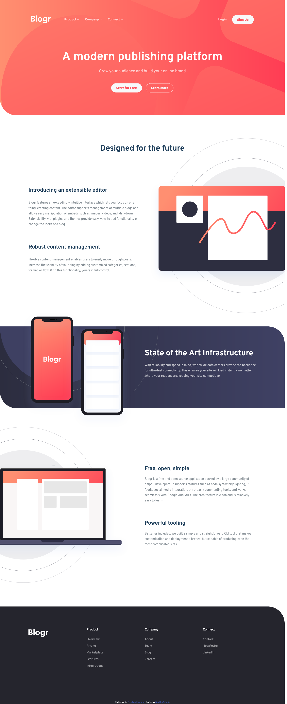
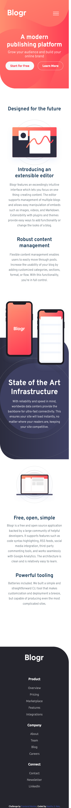
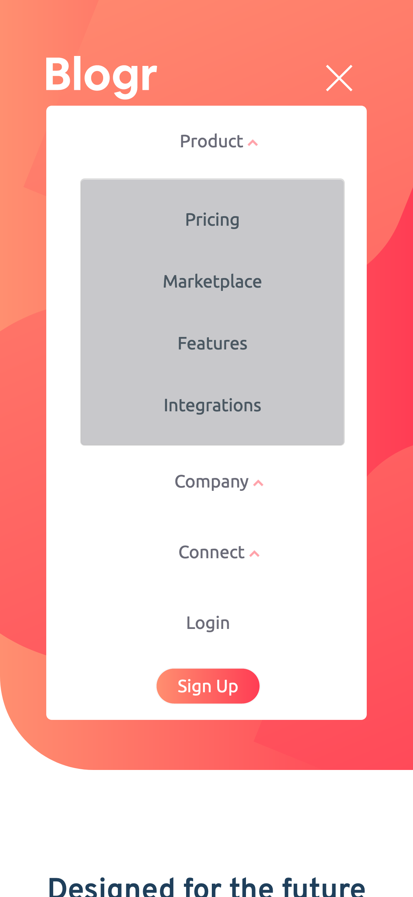

# Frontend Mentor - Blogr landing page solution

This is a solution to the [Blogr landing page challenge on Frontend Mentor](https://www.frontendmentor.io/challenges/blogr-landing-page-EX2RLAApP). Frontend Mentor challenges help you improve your coding skills by building realistic projects.

## Table of contents

- [Overview](#overview)
  - [The challenge](#the-challenge)
  - [Screenshot](#screenshot)
  - [Links](#links)
- [My process](#my-process)
  - [Built with](#built-with)
- [Author](#author)

## Overview

### The challenge

Users should be able to:

- View the optimal layout for the site depending on their device's screen size
- See hover states for all interactive elements on the page

### Screenshot

#### Desktop Design

#### Mobile Design

#### Mobile Menu

### Links

- Solution URL: [@nees101/FrontendMentor](https://www.frontendmentor.io/solutions/blogr-landing-page-using-custom-css-properties-bootstrap-and-jquery-dtOZ0VLxJ)
- Live Site URL: [@nees101/github](https://nees101.github.io/blogr-landing-page-main/)

## My process

### Built with

- Semantic HTML5 markup
- CSS custom properties
- Bootstrap
- jQuery

## Author

- Github - [@nees101](https://www.github.com/nees101)
- Frontend Mentor - [@nees101](https://www.frontendmentor.io/profile/nees101)
